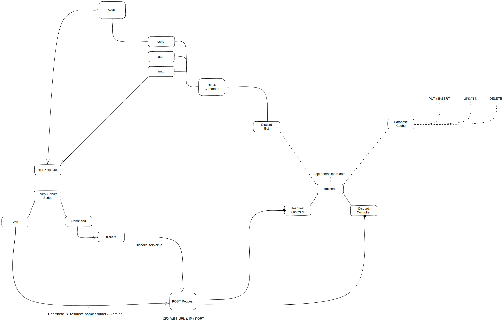

# Authentication server

#### What data the backend stores



* Port of the server
* IP of the server
* CFX web link of the server

<figure><figcaption>
Example database entry
</figcaption></figure>



* The server id (refrence)
* The script ([RocketSoccer](rocket-soccer/) / [EasyMapChange](easy-map-change/))
* The resource name ([Folder name](https://docs.fivem.net/natives/?\_0xE5E9EBBB))
* The current script version

<figure><figcaption>
Example database entry
</figcaption></figure>



* The server id (refrence)
* The Discord server id

<figure><figcaption>
Example database entry
</figcaption></figure>



#### Why do we collect and store this data?

