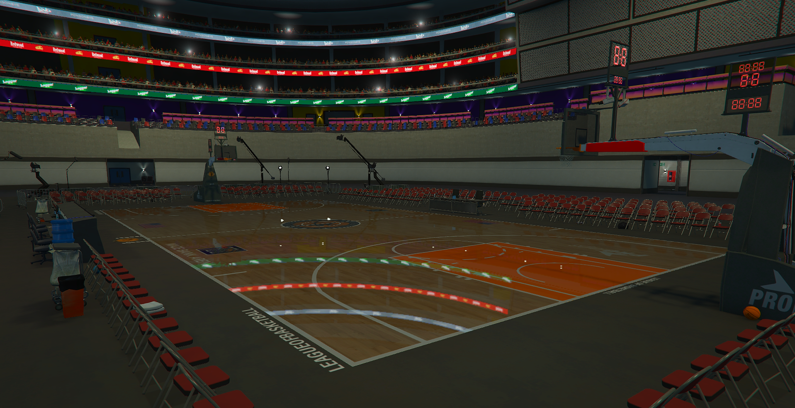

# Maps

| Enum                                    | Picture                                                  |
| --------------------------------------- | -------------------------------------------------------- |
| **BASKETBALL**                          |            |
| **DERBY**                               |               |
| **PAINTBALL**                           |           |
| **CONCERT**                             |             |
| **FASHION**                             |             |
| **FAME\_OR\_SHAME**                     |       |
| **WRESTLING**                           |           |
| **MMA**                                 |                 |
| **BOXING**                              |              |
| **CURLING**                             |             |
| [**ROCKET\_LEAGUE**](../rocket-soccer/) |       |
| **FOOTBALL**                            |            |
| **HOCKEY**                              |              |
| **GOKART\_TRACK\_1**                    |      |
| **GOKART\_TRACK\_2**                    |      |
| **TRACKMANIA\_TRACK\_1**                |  |
| **TRACKMANIA\_TRACK\_2**                |  |
| **TRACKMANIA\_TRACK\_3**                |  |
| **TRACKMANIA\_TRACK\_4**                |  |


The upper or lower case must not be observed


