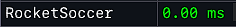

# Maps

| Enum                                    | Picture                                     |
| --------------------------------------- | ------------------------------------------- |
| **BASKETBALL**                          |         |
| **DERBY**                               | .png>) |
| **PAINTBALL**                           | .png>) |
| **CONCERT**                             | .png>) |
| **FASHION**                             | .png>)  |
| **FAME\_OR\_SHAME**                     | .png>)  |
| **WRESTLING**                           | .png>) |
| **MMA**                                 | .png>)  |
| **BOXING**                              | .png>) |
| **CURLING**                             | .png>) |
| [**ROCKET\_LEAGUE**](../rocket-soccer/) | .png>) |
| **FOOTBALL**                            | .png>) |
| **HOCKEY**                              | .png>)  |
| **GOKART\_TRACK\_1**                    | .png>)  |
| **GOKART\_TRACK\_2**                    | .png>) |
| **TRACKMANIA\_TRACK\_1**                | .png>) |
| **TRACKMANIA\_TRACK\_2**                | .png>) |
| **TRACKMANIA\_TRACK\_3**                | .png>) |
| **TRACKMANIA\_TRACK\_4**                | .png>) |


The upper or lower case must not be observed


